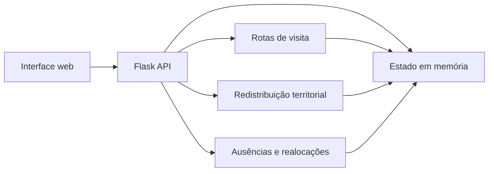

# Quadrante

**Roteirização e divisão territorial para equipes de fiscalização de campo.**

O Quadrante é um projeto acadêmico em Python que explora um problema prático: como distribuir condomínios entre fiscais, planejar a ordem das visitas e reorganizar as carteiras quando alguém se ausenta. A aplicação combina algoritmos geográficos com quatro estruturas de dados implementadas do zero e usadas no estado do sistema.

A demonstração parte de uma base com **9 fiscais e 127 condomínios** em Maceió (AL). Os nomes são fictícios; as coordenadas representam pontos reais usados como massa de teste geográfica.

## O que dá para fazer

- Visualizar no mapa a carteira de condomínios de cada fiscal.
- Selecionar um fiscal e gerar uma ordem de visitas com distância total estimada.
- Pedir uma sugestão de redistribuição territorial e aplicar as mudanças.
- Registrar ausências em uma fila e processá-las por ordem de chegada.
- Redistribuir a carteira de um fiscal ausente considerando proximidade e carga adicional.
- Desfazer a realocação mais recente, reverter realocações expiradas ou reiniciar a demonstração.

## Como funciona



| Problema | Abordagem no projeto |
| --- | --- |
| Ordem de visitas | Distância Haversine, vizinho mais próximo e melhoria 2-opt para sugerir um caminho aberto. |
| Divisão territorial | k-means geográfico com centroides iniciais baseados nas carteiras atuais e rebalanceamento de carga. |
| Cobertura de ausências | Alocação gulosa entre fiscais de campo disponíveis, considerando distância e carga adicional. |

As distâncias são calculadas a partir de coordenadas. A rota é uma **estimativa geográfica**, não um trajeto por ruas ou uma consulta a serviços de trânsito.

### Estruturas de dados na prática

| Estrutura | Uso |
| --- | --- |
| Vetor dinâmico | Cadastro e consulta dos fiscais. |
| Lista encadeada | Carteira de condomínios de cada fiscal. |
| Fila (FIFO) | Solicitações de ausência, atendidas na ordem de chegada. |
| Pilha (LIFO) | Histórico para desfazer a realocação mais recente. |

As implementações estão em [`quadrante-python/backend/estruturas/`](quadrante-python/backend/estruturas/).

## Tecnologias

- **Backend:** Python e Flask.
- **Frontend:** HTML, CSS, JavaScript e Leaflet para o mapa.
- **Testes:** pytest.
- **Dados da demonstração:** arquivo JSON carregado em memória na inicialização.

## Rodando localmente

Requer **Python 3.10 ou superior**. Na raiz do repositório:

```powershell
cd quadrante-python
py -m venv .venv
.\.venv\Scripts\Activate.ps1
python -m pip install -r requirements.txt
python app.py
```

Abra **http://localhost:5000** no navegador. O mapa usa Leaflet e tiles carregados pela internet; para visualizá-lo, mantenha a conexão ativa.

Em Linux ou macOS, substitua a criação e ativação do ambiente por `python3 -m venv .venv` e `source .venv/bin/activate`.

Para executar os testes, dentro de `quadrante-python/`:

```powershell
python -m pytest
```

## Estrutura do repositório

```text
.
`-- quadrante-python/
    |-- app.py                  # Rotas Flask e página inicial
    |-- backend/
    |   |-- domain/             # Entidades do problema
    |   |-- estruturas/         # Vetor, lista, fila e pilha
    |   |-- repository/         # Estado em memória
    |   |-- seed/               # Dados da demonstração
    |   `-- service/            # Roteirização, clustering e realocação
    |-- frontend/              # Template, estilos e JavaScript
    `-- tests/                 # Testes das estruturas e serviços
```

## Escopo da demonstração

Este repositório apresenta uma versão didática do problema. O estado fica **somente em memória**: alterações feitas pela interface não persistem após reiniciar o servidor. A aplicação não inclui autenticação nem deve ser exposta como serviço de produção. O botão **Reiniciar demonstração** recarrega os dados iniciais.
