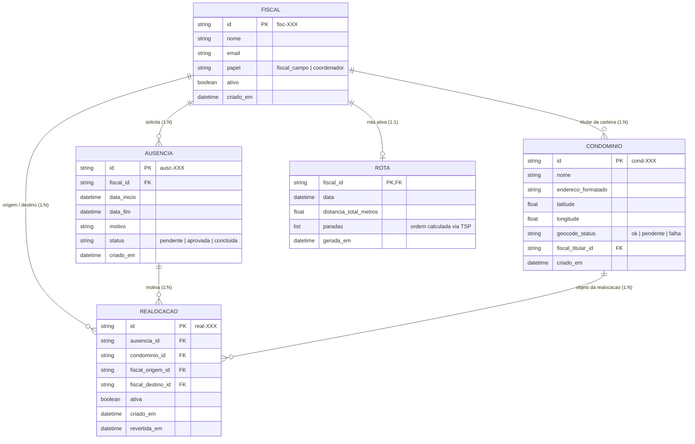

# Modelagem de Dados e Arquitetura de Estruturas — Quadrante

Este documento detalha a modelagem de dados do sistema **Quadrante**, o Diagrama Entidade-Relacionamento (DER), a estrutura de índices em memória e a fundamentação teórica para a escolha de cada estrutura de dados exigida no projeto da disciplina.

---

## 1. Contexto e Decisão Arquitetural de Persistência

Por decisão de arquitetura para a disciplina de Estruturas de Dados, o sistema **não utiliza SGBD externo (como PostgreSQL ou SQLite)**. Toda a persistência é gerida em memória pelo repositório central (`backend/repository/store.py`), que atua como o motor de dados do sistema.

Para assegurar integridade, tempo de resposta baixo e fidelidade ao problema real de despacho de fiscais em Maceió-AL, os dados de domínio residem nas **quatro estruturas de dados fundamentais implementadas manualmente**:
1. **Vetor** (`backend/estruturas/vetor.py`)
2. **Lista Encadeada** (`backend/estruturas/lista_encadeada.py`)
3. **Pilha** (`backend/estruturas/pilha.py`)
4. **Fila** (`backend/estruturas/fila.py`)

A tabela hash nativa da linguagem (`dict`) é empregada estritamente como **índice secundário em memória** (lookup $O(1)$), espelhando o papel de índices B-Tree/Hash de um banco de dados relacional.

---

## 2. Diagrama Entidade-Relacionamento (DER)

### 2.1. Visualização Mermaid

### 2.2. Esquema Relacional Lógico Equivalente

- **`fiscais`** (`id` [PK], `nome`, `email`, `papel`, `ativo`, `criado_em`)
- **`condominios`** (`id` [PK], `nome`, `endereco_formatado`, `latitude`, `longitude`, `geocode_status`, `fiscal_titular_id` [FK -> fiscais.id], `criado_em`)
- **`ausencias`** (`id` [PK], `fiscal_id` [FK -> fiscais.id], `data_inicio`, `data_fim`, `motivo`, `status`, `criado_em`)
- **`realocacoes`** (`id` [PK], `ausencia_id` [FK -> ausencias.id], `condominio_id` [FK -> condominios.id], `fiscal_origem_id` [FK -> fiscais.id], `fiscal_destino_id` [FK -> fiscais.id], `ativa`, `criado_em`, `revertida_em`)
- **`rotas`** (`fiscal_id` [PK, FK -> fiscais.id], `data`, `distancia_total_metros`, `paradas`, `gerada_em`)

---

## 3. Justificativa Teórica das Estruturas de Dados

Cada estrutura foi posicionada onde suas características mecânicas e de complexidade algorítmica representam a escolha ótima para a regra de negócio:

### 3.1. Vetor (`Vetor` com redimensionamento geométrico)
- **Onde é usado:** `Store.fiscais`.
- **Implementação:** Array de capacidade fixa com duplicação de tamanho quando atinge a capacidade máxima, sem recorrer a `list.append` como caixa-preta.
- **Justificativa técnica:**
  - O quadro de fiscais de uma empresa de fiscalização é uma coleção de tamanho reduzido e estável (poucas inserções e exclusões no ciclo de vida).
  - A operação predominante é a iteração sequencial completa e acesso por índice direto ($O(1)$) para renderização do painel e despacho.
  - Custo amortizado de inserção: $O(1)$. Custo de leitura por posição: $O(1)$. Localidade espacial de cache ótima em memória.

### 3.2. Lista Encadeada Simples (`ListaEncadeada`)
- **Onde é usado:** `Store._carteiras[fiscal_id]`, representando a carteira de condomínios de cada fiscal.
- **Implementação:** Nós dinâmicos (`No`) encadeados por ponteiro `proximo`, com controle de `cabeca` e `tamanho`, sem uso de `collections.deque`.
- **Justificativa técnica:**
  - A carteira de um fiscal tem alta volatilidade durante o expediente de despacho: redistribuições geográficas (k-means), coberturas de ausência e transferências individuais movem condomínios frequentemente de uma carteira para outra.
  - Em uma lista encadeada, transferir um nó consiste em desconectar e religar ponteiros em $O(1)$ (quando na posição), sem necessidade de deslocamento em bloco de memória contígua ($O(N)$ num vetor) nem risco de realocação de buffers.
  - Permite isolamento completo da carteira de cada fiscal em coleções desacopladas.

### 3.3. Pilha (`Pilha` LIFO - Last-In, First-Out)
- **Onde é usado:** `Store.historico_realocacoes`.
- **Implementação:** Nós encadeados com ponteiro de topo, garantindo inserção (`empilhar`) e remoção (`desempilhar`) estritamente em $O(1)$.
- **Justificativa técnica:**
  - Regra de negócio: a operação de reversão manual ("Desfazer realocação") exige semântica transacional estrita de desfazer a ação mais recente antes das mais antigas (Rollback / LIFO).
  - Ao empilhar cada ID de `Realocacao` executada, a operação `desfazer_ultima_realocacao` localiza imediatamente a última alteração ativa efetuada no sistema em $O(1)$ (ou filtrando inativos mantendo a ordem estrita através de pilha auxiliar).

### 3.4. Fila (`Fila` FIFO - First-In, First-Out)
- **Onde é usado:** `Store.fila_solicitacoes_ausencia`.
- **Implementação:** Lista encadeada com ponteiros de `cabeca` (início) e `cauda` (fim), garantindo enfileiramento (`enfileirar`) e desenfileiramento (`desenfileirar`) ambos em $O(1)$ real.
- **Justificativa técnica:**
  - Regra de negócio: solicitações de ausência (férias, atestados, folgas) devem ser triadas e atendidas em conformidade com a ordem cronológica de solicitação (fair scheduling / FIFO).
  - Impede a inanição (starvation) de pedidos antigos e assegura que a redistribuição territorial temporária respeite a cronologia de entrada dos pedidos.

---

## 4. Índices e Mecanismos de Acesso em Memória

Para garantir tempo de resposta na escala de sub-milissegundos ($< 1$ ms) sem abrir mão do encapsulamento das 4 estruturas fundamentais, a camada `Store` mantém mapas hash auxiliares equivalentes aos índices primários e secundários de um banco de dados relacional:

| Índice em Memória | Tipo | Complexidade | Equivalente Relacional | Finalidade |
|---|---|---|---|---|
| `_condominios` | `dict[str, Condominio]` | $O(1)$ | Clustered Index (PK `id`) | Acesso direto a condomínio por ID sem percorrimento linear. |
| `_titular_de` | `dict[str, str]` | $O(1)$ | Non-Clustered Index (`condominio_id` -> `fiscal_id`) | Localiza instantaneamente a qual carteira (`ListaEncadeada`) o condomínio pertence para permitir remoção direcionada. |
| `_carteiras` | `dict[str, ListaEncadeada]` | $O(1)$ | Foreign Key Hash Bucket (`fiscal_id` -> Carteira) | Aponta diretamente para a lista encadeada da carteira do fiscal. |
| `_ausencias` | `dict[str, Ausencia]` | $O(1)$ | Clustered Index (PK `id`) | Consulta e atualização do ciclo de vida de ausências. |
| `_realocacoes` | `dict[str, Realocacao]` | $O(1)$ | Clustered Index (PK `id`) | Lookup de auditoria e status de reversão de realocações. |
| `_rotas` | `dict[str, Rota]` | $O(1)$ | Unique Index (`fiscal_id`) | Cache da última rota gerada por fiscal. |

### Concorrência e Isolamento
Todas as operações de escrita e leitura crítica utilizam um mutex reentrante (`threading.Lock`), garantindo atomicidade das transações de redistribuição (remoção da carteira A + inserção na carteira B + atualização de índice auxiliar).

---

## 5. Algoritmos e Complexidade Computacional

### 5.1. Roteirização TSP (`RoutingService`)
- **Problema:** Encontrar a menor rota fechada/aberta para visitar todos os condomínios da carteira de um fiscal.
- **Estratégia:**
  1. Construção gulosa via **Nearest Neighbor** (Vizinho Mais Próximo): $O(N^2)$, onde $N$ é o número de condomínios da carteira.
  2. Refinamento local via **2-opt**: examina inversões de arestas cruzadas para desatar nós no trajeto: $O(I \times N^2)$, com $I \le 50$ iterações.
- **Complexidade Total:** $O(N^2)$ no pior caso. Para uma carteira de 20 a 25 condomínios, executa em menos de 1 milissegundo.

### 5.2. Agrupamento Geográfico (`ClusteringService`)
- **Problema:** Divisão territorial equitativa dos condomínios entre $K$ fiscais de campo em Maceió.
- **Estratégia:**
  1. **Centróides Iniciais Baseados no Histórico:** calculados a partir da média geográfica da carteira atual de cada fiscal, mantendo a afinidade territorial prévia.
  2. **K-Means Geográfico (Lloyd com Haversine):** $O(M \times N \times K)$, onde $M$ é o número de iterações até convergência ($M \le 50$), $N$ é o total de condomínios ($N = 117$) e $K = 6$.
  3. **Rebalanceamento Bidirecional de Carga:**
     - Teto máximo: $130\%$ da média ($19.5 \times 1.3 \approx 25$).
     - Piso mínimo: média dividida pela tolerância ($19.5 / 1.3 = 15$).
     - Ajuste com transferência para clusters adjacentes mais próximos.
- **Complexidade Total:** $O(M \cdot N \cdot K + N \log N)$. Executa em tempo inferior a 5 milissegundos.

### 5.3. Alocação Gulosa por Ausência (`ReallocationService`)
- **Problema:** Redistribuir a carteira de um fiscal ausente entre os fiscais ativos sem sobrecarregar ninguém.
- **Estratégia:** Para cada condomínio órfão, calcula a distância Haversine para o centróide atual de cada fiscal elegível (coordenadores nunca recebem carteira). Desempata por:
  1. Menor distância geográfica;
  2. Menor carga temporária já acumulada;
  3. ID lexicográfico estável.
- **Complexidade Total:** $O(N_{\text{ausente}} \times K_{\text{ativos}})$. Execução instantânea ($< 0.5$ ms).

---

## 6. Resumo das Estruturas e Complexidades

| Operação | Vetor (`Fiscais`) | Lista Encadeada (`Carteira`) | Pilha (`Histórico`) | Fila (`Solicitações`) |
|---|---|---|---|---|
| Inserção | $O(1)$ amortizado | $O(1)$ (no fim/início) | $O(1)$ (topo) | $O(1)$ (cauda) |
| Remoção | $O(N)$ (deslocamento) | $O(1)$ (nó identificado) | $O(1)$ (topo) | $O(1)$ (cabeça) |
| Acesso por Índice | $O(1)$ | $O(N)$ | Não aplicável | Não aplicável |
| Consulta Topo / Frente | Não aplicável | $O(1)$ (cabeça) | $O(1)$ | $O(1)$ |
| Semântica Dominante | Tabela de Entidades | Coleção Dinâmica | Desfazer / Rollback | Triagem Justa / FIFO |
